Module 1: AI-Generated Vulnerable App
======================================

This module introduces you to AI-assisted coding using the Cline Extension in Visual Studio
Code. You will generate a vulnerable application using pre-canned prompts and observe both
the benefits and security risks of AI-generated code.

The goal of this module is to:

* Generate a simple vulnerable application (demo-only)
* Observe the benefits through the use of VSCode with Cline Extension and see how files and code are generated
* Point out the flaws and vulnerabilities of AI-assisted coding and Vibe Coding

.. warning::
   **Critical: Understanding Vibe Coding Risks**

   "Vibe Coding" refers to AI-assisted development where developers accept AI-generated code without
   immediate security validation. Recent studies show **~45% of AI-generated code samples contain known
   vulnerabilities** including SQL injection, XSS, and hardcoded secrets. This module demonstrates why
   security oversight is essential in AI-assisted workflows.

.. note::
   **Throwaway Demo vs. Production Code**

   The application generated in this module is a **throwaway demonstration** designed solely to highlight
   AI coding flaws. It is NOT used in subsequent labs. In Module 2, you will work with a **pre-vetted**
   (but still intentionally vulnerable) application that has been prepared for the CI/CD pipeline exercises.

**Expected Lab Time: 15-20 minutes**

Task 1: Explore VSCode and Cline Extension
~~~~~~~~~~~~~~~~~~~~~~~~~~~~~~~~~~~~~~~~~~

The following steps will allow you to explore the VSCode environment and the Cline Extension
configuration. You will then use AI to generate a vulnerable application to understand the risks
associated with Vibe Coding.

+---------------------------------------------------------------------------------------------------------------+
| **Access VSCode Server**                                                                                      |
+===============================================================================================================+
| 1. Open your browser and navigate to the VSCode Server URL provided in your lab environment. Verify that      |
|                                                                                                               |
|    VSCode loads successfully in your browser.                                                                 |
|                                                                                                               |
| |module1-vscode_browser|                                                                                      |
+---------------------------------------------------------------------------------------------------------------+
| 2. Familiarize yourself with the VSCode interface. Note the sidebar icons for file explorer, search, source   |
|                                                                                                               |
|    control, and extensions.                                                                                   |
|                                                                                                               |
| |module1-vscode_interface|                                                                                    |
+---------------------------------------------------------------------------------------------------------------+

+---------------------------------------------------------------------------------------------------------------+
| **Explore Cline Extension Configuration**                                                                     |
+===============================================================================================================+
| 1. In VSCode, locate the **Cline Extension** in the sidebar. Click on the Cline icon to open the extension    |
|                                                                                                               |
|    panel.                                                                                                     |
|                                                                                                               |
| |module1-cline_sidebar|                                                                                       |
+---------------------------------------------------------------------------------------------------------------+
| 2. Review the Cline Extension configuration settings. Verify the following settings are configured:           |
|                                                                                                               |
|    * **API Provider:** *GCP Vertex AI*                                                                        |
|    * **Project ID:** *f5-gcs-4261-sales-appworld2026*                                                         |
|    * **Region:** *us-central1*                                                                                |
|    * **Model:** *gemini-2.5-flash*                                                                            |
|                                                                                                               |
| |module1-cline_config|                                                                                        |
|                                                                                                               |
| .. note::                                                                                                     |
|    *The Cline Extension has been pre-configured with access to Gemini 2.5 flash using a GCP service account.* |
|    *Your instructor will provide the Project ID if needed.*                                                   |
+---------------------------------------------------------------------------------------------------------------+
| 3. Explore the Cline Extension capabilities by reviewing the available options and commands in the panel.     |
|                                                                                                               |
| |module1-cline_capabilities|                                                                                  |
+---------------------------------------------------------------------------------------------------------------+

+---------------------------------------------------------------------------------------------------------------+
| **Understand Cline Plan vs Act Mode**                                                                         |
+===============================================================================================================+
| 1. Before generating code, understand the difference between Cline's **Plan** and **Act** modes:              |
|                                                                                                               |
|    * **Plan Mode:** The AI analyzes the request and proposes a plan of action without executing changes.      |
|      This allows you to review the AI's decision-making process before any code is written.                   |
|    * **Act Mode:** The AI executes the plan, creating files and writing code directly.                        |
|                                                                                                               |
| |module1-cline-start-new-task|                                                                                |
|                                                                                                               |
| .. note::                                                                                                     |
|    *Understanding Plan vs Act is critical for safe Vibe Coding. Plan mode gives you visibility into what*     |
|    *the AI intends to do, while Act mode executes those intentions. Security-conscious developers should*     |
|    *always review the Plan before allowing the AI to Act.*                                                    |
+---------------------------------------------------------------------------------------------------------------+
| 2. Click **Start New Task** in the Cline panel to begin a new AI interaction.                                 |
|                                                                                                               |
| |module1-cline_prompt_input|                                                                                  |
+---------------------------------------------------------------------------------------------------------------+

+---------------------------------------------------------------------------------------------------------------+
| **Generate Vulnerable Application Using AI**                                                                  |
+===============================================================================================================+
| 1. In the Cline Extension panel, enter the following **pre-canned prompt** to generate a vulnerable           |
|                                                                                                               |
|    application:                                                                                               |
|                                                                                                               |
| .. code-block:: text                                                                                          |
|                                                                                                               |
|    Create a simple Flask web application with the following features:                                         |
|    - A login page that accepts username and password                                                          |
|    - A search page that queries a SQLite database                                                             |
|    - A comments section where users can post messages                                                         |
|    - Store the database credentials in a config file                                                          |
|    Make it functional but keep the code simple for demonstration purposes.                                    |
|                                                                                                               |
| |module1-cline-demo-app-plan|                                                                                 |
+---------------------------------------------------------------------------------------------------------------+
| 2. Observe the **Plan** that Cline generates. Review the AI's proposed approach to building the application.  |
|                                                                                                               |
|    Notice how the AI plans to implement features - this is where security vulnerabilities often originate.    |
|                                                                                                               |
| |module1-cline-demo-app-plan-response|                                                                        |
|                                                                                                               |
| .. warning::                                                                                                  |
|    *Pay attention to how the AI plans to handle user inputs, database queries, and credential storage.*       |
|    *These are common areas where Vibe Coding introduces vulnerabilities.*                                     |
+---------------------------------------------------------------------------------------------------------------+
| 3. Allow Cline to **Act** and execute the plan. Watch as the AI creates files and writes code.                |
|                                                                                                               |
| |module1-cline-demo-app-act|                                                                                  |
+---------------------------------------------------------------------------------------------------------------+
| 4. Observe the file explorer updating as new files are created. The AI will generate multiple files           |
|                                                                                                               |
|    including Python code, HTML templates, and configuration files.                                            |
|                                                                                                               |
| |module1-cline-demo-app-act-3-task-completed|                                                                  |
|                                                                                                               |
| .. note::                                                                                                     |
|    *The AI may take a few minutes to generate all files. Do not interrupt the process until it completes.*    |
|    *Some student-generated applications might fail - this is expected with Vibe Coding due to the*            |
|    *non-deterministic nature of generative AI.*                                                               |
+---------------------------------------------------------------------------------------------------------------+

+---------------------------------------------------------------------------------------------------------------+
| **Run and Test the Generated Application**                                                                    |
+===============================================================================================================+
| 1. Once Cline completes code generation, open the integrated terminal in VSCode by selecting                  |
|                                                                                                               |
|    **Terminal > New Terminal**.                                                                               |
|                                                                                                               |
| |module1-cline-demo-app-terminal|                                                                             |
+---------------------------------------------------------------------------------------------------------------+
| 2. Navigate to the generated application directory and start the Flask application:                          |
|                                                                                                               |
| .. code-block:: bash                                                                                          |
|                                                                                                               |
|    cd demo-app                                                                                                |
|    flask run --host=0.0.0.0 --port=5000                                                                       |
|                                                                                                               |
| |module1-cline-demo-app-act-3-flask-command|                                                                   |
+---------------------------------------------------------------------------------------------------------------+
| 3. Verify the Flask application is running by checking for the startup message in the terminal.               |
|                                                                                                               |
| |module1-cline-demo-app-terminal-4-flask-running|                                                              |
+---------------------------------------------------------------------------------------------------------------+
| 4. Open Firefox in your lab environment and navigate to the application URL to test functionality.            |
|                                                                                                               |
| |module1-cline-demo-app-terminal-4-firefox|                                                                    |
|                                                                                                               |
| .. note::                                                                                                     |
|    *If you see a Chrome pop-up, select Firefox as your browser for this lab.*                                 |
|                                                                                                               |
| |module1-cline-demo-app-terminal-4-chrome-popup|                                                               |
+---------------------------------------------------------------------------------------------------------------+
| 5. Enter the application URL in Firefox's address bar.                                                        |
|                                                                                                               |
| |module1-cline-demo-app-terminal-4-firefox-address|                                                            |
+---------------------------------------------------------------------------------------------------------------+

+---------------------------------------------------------------------------------------------------------------+
| **Review Generated Code and Identify Vulnerabilities**                                                        |
+===============================================================================================================+
| 1. Return to VSCode and open the generated files to review the code structure. Click on each file in the      |
|                                                                                                               |
|    explorer to view its contents.                                                                             |
|                                                                                                               |
| |module1-review_code|                                                                                         |
+---------------------------------------------------------------------------------------------------------------+
| 2. Identify potential security vulnerabilities in the generated code. Common vulnerabilities in AI-generated  |
|                                                                                                               |
|    code include:                                                                                              |
|                                                                                                               |
|    * **SQL Injection (SQLi):** Unsanitized user inputs in database queries                                    |
|    * **Cross-Site Scripting (XSS):** Improper output encoding in templates                                    |
|    * **Log Injection:** Unsanitized data written to logs                                                      |
|    * **Hardcoded Secrets:** API keys or credentials embedded directly in code                                 |
|                                                                                                               |
| |module1-vulnerabilities|                                                                                     |
|                                                                                                               |
| .. warning::                                                                                                  |
|    *This is the core danger of Vibe Coding: the AI creates functional code that appears correct but*          |
|    *contains serious security flaws. Without proper review, these vulnerabilities would reach production.*    |
+---------------------------------------------------------------------------------------------------------------+
| 3. Your instructor will demonstrate a pre-scanned application using F5XC WAS to show the types of             |
|                                                                                                               |
|    vulnerabilities detected in AI-generated code.                                                             |
|                                                                                                               |
| |module1-was_scan_results|                                                                                    |
+---------------------------------------------------------------------------------------------------------------+

+---------------------------------------------------------------------------------------------------------------+
| **Clean Up Demo Application**                                                                                 |
+===============================================================================================================+
| 1. Stop the running Flask application by pressing **Ctrl+C** in the terminal.                                 |
|                                                                                                               |
| |module1-cline-demo-app-terminal-ctrlc-close|                                                                  |
+---------------------------------------------------------------------------------------------------------------+
| 2. This demo application will not be used in subsequent modules. In Module 2, you will work with a            |
|                                                                                                               |
|    **pre-vetted vulnerable application** that has been prepared for the CI/CD pipeline exercises.             |
|                                                                                                               |
| |module1-cline-demo-app-cleanup|                                                                               |
+---------------------------------------------------------------------------------------------------------------+

+---------------------------------------------------------------------------------------------------------------+
| **Objective Check: Code. Secure. Repeat.**                                                                    |
+===============================================================================================================+
| In this task, you completed the **CODE** phase of the DevSecOps loop:                                         |
|                                                                                                               |
|    ✓ **CODE (AI-assisted):** You used Cline Extension to generate application code                            |
|    ✓ **Observed Vibe Coding risks:** You saw how AI introduces vulnerabilities                                |
|    ✓ **Understood Plan vs Act:** You learned to review AI decisions before execution                          |
|                                                                                                               |
| **Next Steps:** In Module 2, you will **COMMIT** code to GitLab, trigger **SCAN** (SAST), and **PROTECT**     |
| the application with F5XC WAAP - completing the security loop.                                                |
|                                                                                                               |
|    **Code → Commit → Scan → Protect → Improve → Repeat**                                                      |
+---------------------------------------------------------------------------------------------------------------+

+---------------------------------------------------------------------------------------------------------------+
| **End of Module 1**                                                                                           |
+===============================================================================================================+
| This concludes Module 1. In this module, you learned about AI-assisted coding using the Cline Extension and   |
|                                                                                                               |
| observed how AI can introduce security vulnerabilities into generated code. Key takeaways:                    |
|                                                                                                               |
|    * AI coding assistants boost productivity but require security oversight                                   |
|    * Vibe Coding (accepting AI suggestions without review) introduces significant security risks              |
|    * Understanding Plan vs Act modes helps you review AI decisions before execution                           |
|    * DevSecOps practices are essential to catch vulnerabilities introduced by AI-assisted development         |
|                                                                                                               |
| Proceed to **Module 2** to deploy and secure the vulnerable application using F5 Distributed Cloud.           |
|                                                                                                               |
| |labend|                                                                                                      |
+---------------------------------------------------------------------------------------------------------------+

.. |module1-vscode_browser| image:: ../_static/module1-vscode_browser.png
   :width: 800px
.. |module1-vscode_interface| image:: ../_static/module1-vscode_interface.png
   :width: 800px
.. |module1-cline_sidebar| image:: ../_static/module1-cline_sidebar.png
   :width: 800px
.. |module1-cline_config| image:: ../_static/module1-cline_config.png
   :width: 800px
.. |module1-cline_capabilities| image:: ../_static/module1-cline_capabilities.png
   :width: 800px
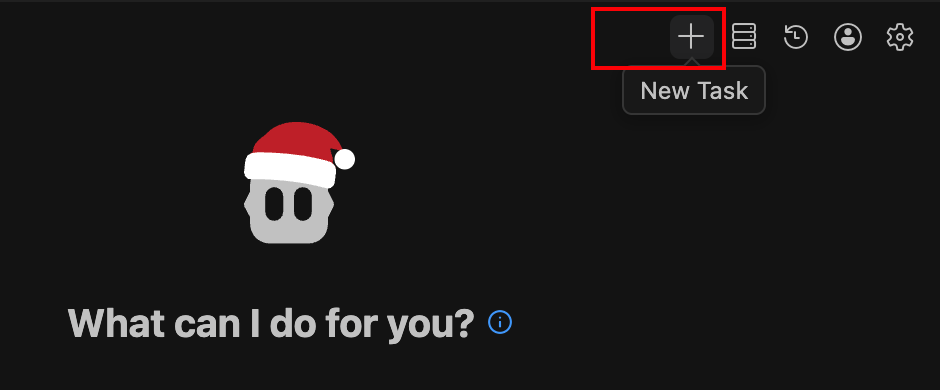
.. |module1-cline_prompt_input| image:: ../_static/module1-cline_prompt_input.png
   :width: 800px
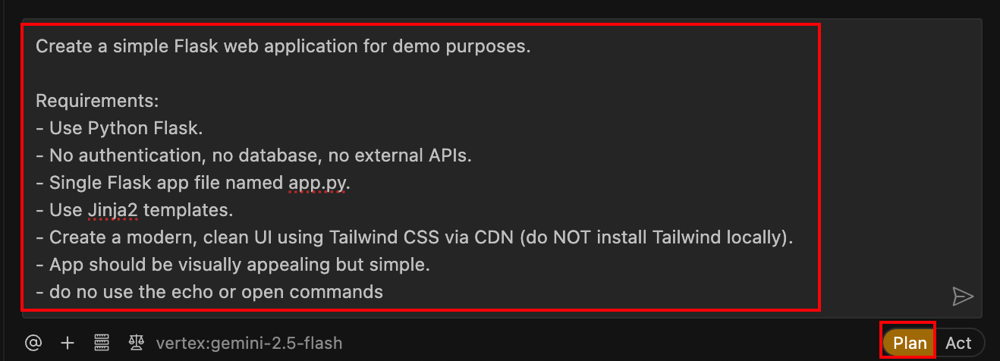
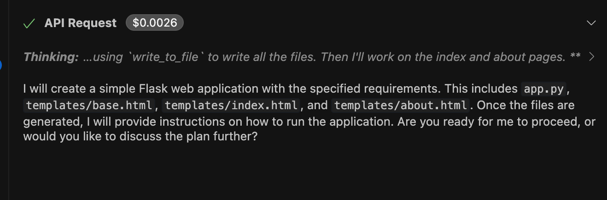
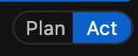
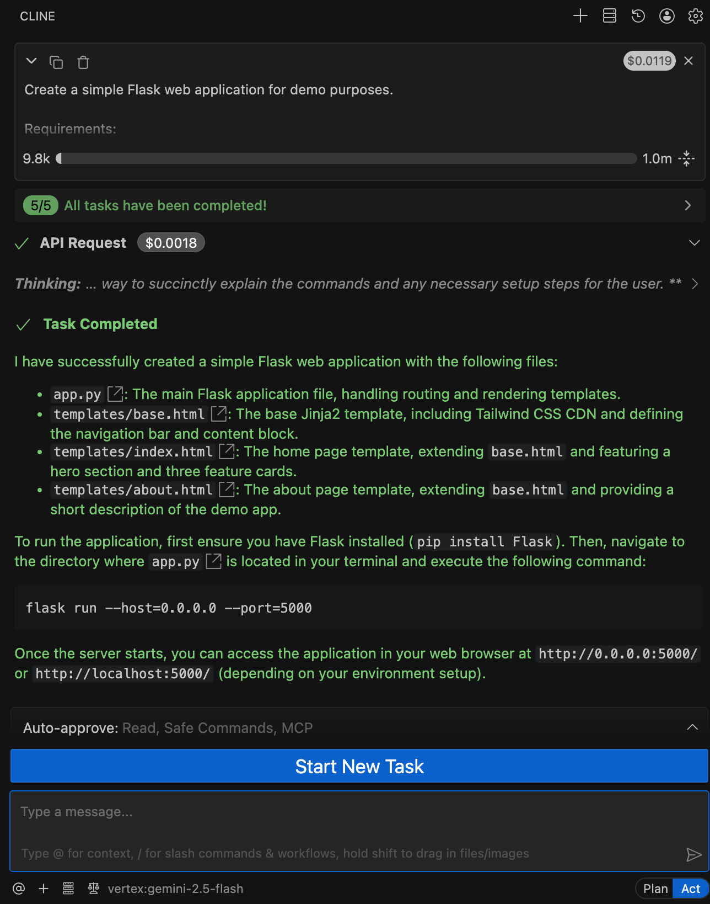
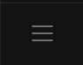
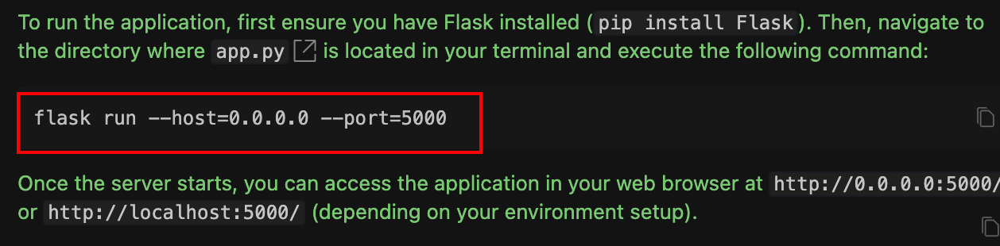
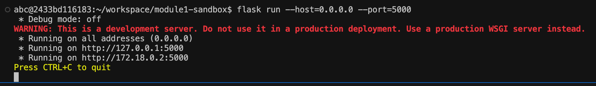
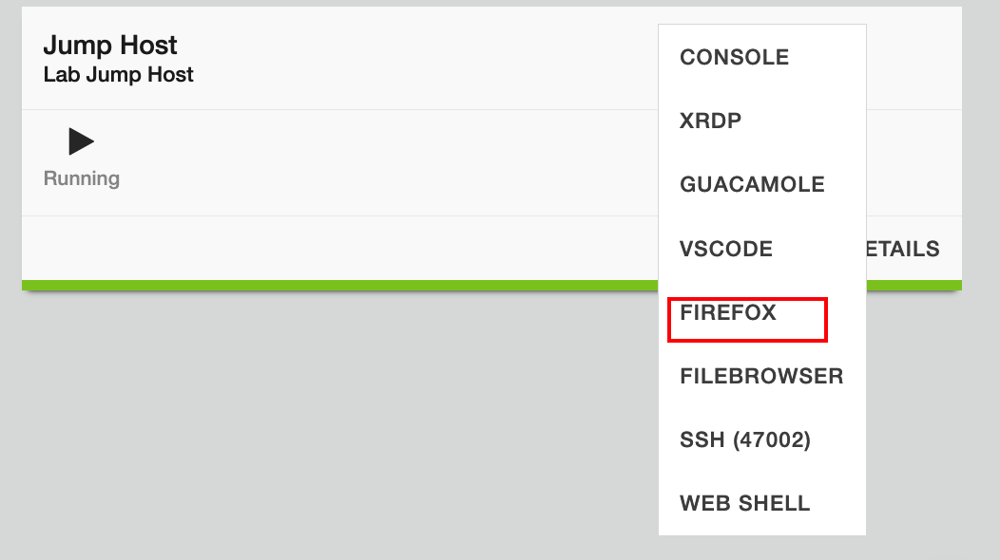
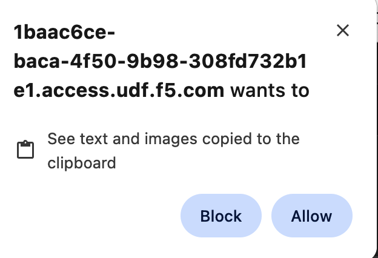
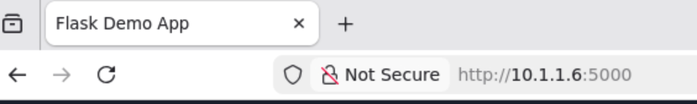
.. |module1-review_code| image:: ../_static/module1-review_code.png
   :width: 800px
.. |module1-vulnerabilities| image:: ../_static/module1-vulnerabilities.png
   :width: 800px
.. |module1-was_scan_results| image:: ../_static/module1-was_scan_results.png
   :width: 800px
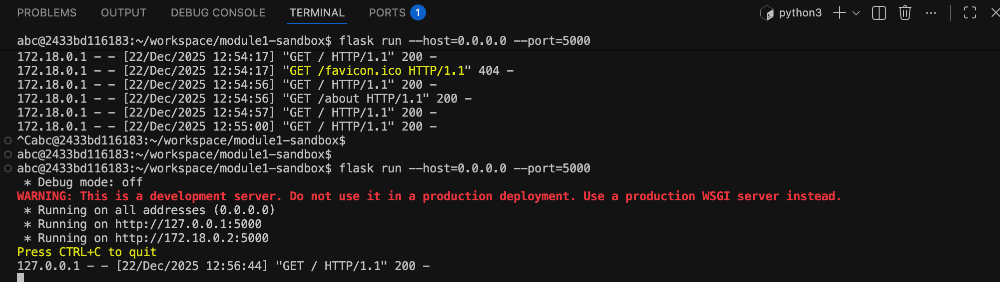
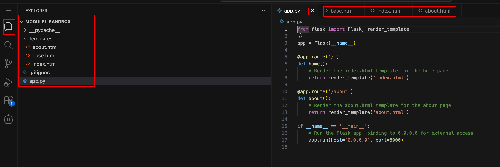
.. |labend| image:: ../_static/labend.png
   :width: 800px

