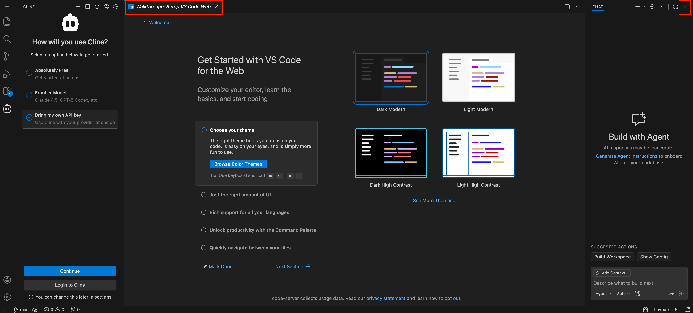
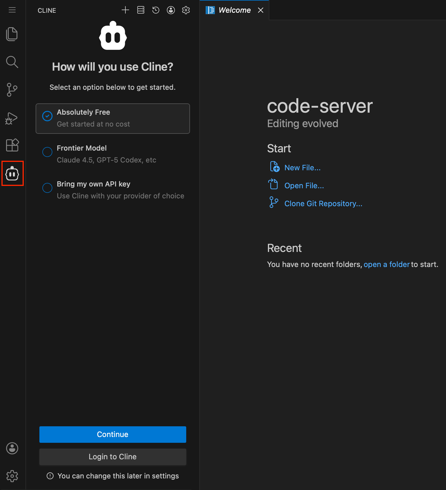
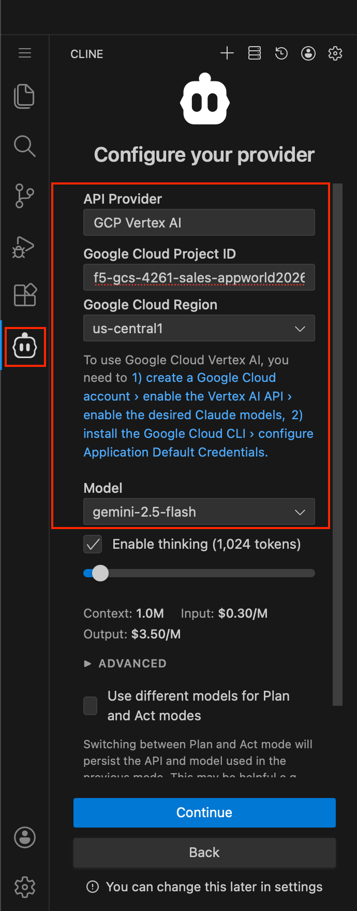
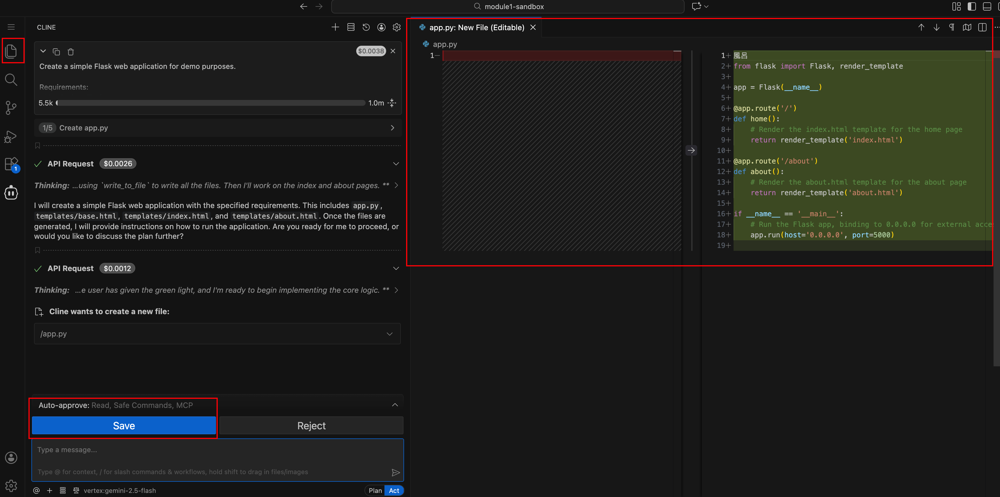

Module 1: AI-Generated Vulnerable App
======================================

This module introduces you to AI-assisted coding using the Cline Extension in Visual Studio
Code. You will generate a vulnerable application using pre-canned prompts and observe both
the benefits and security risks of AI-generated code.

The goal of this module is to:

* Generate a simple vulnerable application (demo-only)
* Observe the benefits through the use of VSCode with Cline Extension and see how files and code are generated
* Point out the flaws and vulnerabilities of AI-assisted coding and Vibe Coding

.. note::
   *The generated demo application is NOT meant to be used for the hands-on sections of the lab.*
   *Some student generated applications might fail, and that is to be expected with Vibe coding*
   *and the non-deterministic nature of generative AI.*

**Expected Lab Time: 15-20 minutes**

Task 1: Explore VSCode and Cline Extension
~~~~~~~~~~~~~~~~~~~~~~~~~~~~~~~~~~~~~~~~~~

The following steps will allow you to explore the VSCode environment and the Cline Extension
configuration. You will then use AI to generate a vulnerable application to understand the risks
associated with "vibe coding."

+---------------------------------------------------------------------------------------------------------------+
| **Access VSCode via UDF environment**                                                                         |
+===============================================================================================================+
| 1. Open your browser and navigate to the VSCode available in your UDF lab environment. Verify that            |
|                                                                                                               |
|    VSCode loads successfully in your browser.                                                                 |
|                                                                                                               |
| |module1-vscode_browser|                                                                                      |
+---------------------------------------------------------------------------------------------------------------+
| 2. Familiarize yourself with the VSCode interface. Note the sidebar icons for file explorer, search, source   |
|                                                                                                               |
|    control, and extensions.                                                                                   |
|                                                                                                               |
| |module1-vscode_interface|                                                                                    |
+---------------------------------------------------------------------------------------------------------------+

+---------------------------------------------------------------------------------------------------------------+
| **Explore Cline Extension Configuration**                                                                     |
+===============================================================================================================+
| 1. In VSCode, locate the **Cline Extension** in the sidebar. Click on the Cline icon to open the extension    |
|                                                                                                               |
|    panel.                                                                                                     |
|                                                                                                               |
| |module1-cline_sidebar|                                                                                       |
+---------------------------------------------------------------------------------------------------------------+
| 2. Review the Cline Extension configuration settings. Verify the following settings are configured:           |
|                                                                                                               |
|    * **API Provider:** *GCP Vertex AI*                                                                        |
|    * **Project ID:** *<Your GCP Project ID>*                                                                  |
|    * **Region:** *us-central1*                                                                                |
|    * **Model:** *gemini-2.5-flash*                                                                            |
|                                                                                                               |
| |module1-cline_config|                                                                                        |
|                                                                                                               |
| .. note::                                                                                                     |
|    *The Cline Extension has been pre-configured with access to Gemini 2.5 flash using a GCP service account.* |
|    *Your instructor will provide the Project ID if needed.*                                                   |
+---------------------------------------------------------------------------------------------------------------+
| 3. Explore the Cline Extension capabilities by reviewing the available options and commands in the panel.     |
|                                                                                                               |
| |module1-review_code.png|                                                                                     |
+---------------------------------------------------------------------------------------------------------------+

+---------------------------------------------------------------------------------------------------------------+
| **Generate Vulnerable Application Using AI**                                                                  |
+===============================================================================================================+
| 1. In the Cline Extension panel, locate the prompt input area at the bottom of the panel.                     |
|                                                                                                               |
| |module1-cline_prompt_input|                                                                                  |
+---------------------------------------------------------------------------------------------------------------+
| 2. Use the **pre-canned prompt** provided by your instructor to generate a vulnerable application. The prompt |
|                                                                                                               |
|    is designed to create a simple application with intentional security vulnerabilities for demonstration     |
|                                                                                                               |
|    purposes.                                                                                                  |
|                                                                                                               |
| |module1-files_created|                                                                                       |
+---------------------------------------------------------------------------------------------------------------+
| 3. Execute the prompt by pressing **Enter** or clicking the **Send** button. Observe how Cline generates      |
|                                                                                                               |
|    code and files automatically.                                                                              |
|                                                                                                               |
| |module1-cline_prompt_input|                                                                                  |
+---------------------------------------------------------------------------------------------------------------+
| 4. Watch as the AI assistant creates multiple files and populates them with code. The file explorer will      |
|                                                                                                               |
|    update as new files are created.                                                                           |
|                                                                                                               |
| |module1-files_created|                                                                                       |
|                                                                                                               |
| .. note::                                                                                                     |
|    *The AI may take a few minutes to generate all files. Do not interrupt the process until it completes.*    |
+---------------------------------------------------------------------------------------------------------------+

+---------------------------------------------------------------------------------------------------------------+
| **Review Generated Code and Identify Vulnerabilities**                                                        |
+===============================================================================================================+
| 1. Open the generated files in VSCode and review the code structure. Click on each file in the explorer to    |
|                                                                                                               |
|    view its contents.                                                                                         |
|                                                                                                               |
| |module1-review_code|                                                                                         |
+---------------------------------------------------------------------------------------------------------------+
| 2. Identify potential security vulnerabilities in the generated code. Common vulnerabilities in AI-generated  |
|                                                                                                               |
|    code may include:                                                                                          |
|                                                                                                               |
|    * **SQL Injection (SQLi):** Unsanitized user inputs in database queries                                    |
|    * **Cross-Site Scripting (XSS):** Improper output encoding                                                 |
|    * **Log Injection:** Unsanitized data written to logs                                                      |
|    * **Hardcoded Secrets:** API keys or credentials embedded in code                                          |
|                                                                                                               |
+---------------------------------------------------------------------------------------------------------------+
| 3. Your instructor will demonstrate a pre-scanned application using F5XC WAS to show the types of             |
|                                                                                                               |
|    vulnerabilities detected in AI-generated code.                                                             |
|                                                                                                               |
+---------------------------------------------------------------------------------------------------------------+

+---------------------------------------------------------------------------------------------------------------+
| **End of Module 1**                                                                                           |
+===============================================================================================================+
| This concludes Module 1. In this module, you learned about AI-assisted coding using the Cline Extension and   |
|                                                                                                               |
| observed how AI can introduce security vulnerabilities into generated code. Key takeaways:                    |
|                                                                                                               |
|    * AI coding assistants boost productivity but require security oversight                                   |
|    * "Vibe coding" (accepting AI suggestions without review) introduces significant security risks            |
|    * DevSecOps practices are essential to catch vulnerabilities introduced by AI-assisted development         |
|                                                                                                               |
| Proceed to **Module 2** to deploy and secure the vulnerable application using F5 Distributed Cloud.           |
|                                                                                                               |
| |labend|                                                                                                      |
+---------------------------------------------------------------------------------------------------------------+

.. |module1-vscode_browser| image:: ../_static/module1-vscode_browser.png
   :width: 800px

.. |module1-cline_capabilities| image:: ../_static/module1-cline_capabilities.png
   :width: 800px

.. |module1-precanned_prompt| image:: ../_static/module1-precanned_prompt.png
   :width: 800px
.. |module1-code_generation| image:: ../_static/module1-code_generation.png
   :width: 800px
.. |module1-files_created| image:: ../_static/module1-files_created.png
   :width: 800px
.. |module1-review_code| image:: ../_static/module1-review_code.png
   :width: 800px
.. |module1-vulnerabilities| image:: ../_static/module1-vulnerabilities.png
   :width: 800px
.. |module1-was_scan_results| image:: ../_static/module1-was_scan_results.png
   :width: 800px
.. |labend| image:: ../_static/labend.png
   :width: 800px

