Module 2: Deploy and Secure F5 AI-Generated App
===============================================

In this module, you will transition from "vibe coding" to a structured DevSecOps workflow.
You'll work with a pre-created F5 AI-generated application, implement security-as-code using
GitLab CI/CD, and deploy runtime protection on F5 Distributed Cloud.

.. note::
   **Pre-Vetted Application**

   Unlike the throwaway demo in Module 1, this module uses a **pre-vetted vulnerable application** that
   has been specifically prepared for the CI/CD pipeline exercises. While it contains intentional
   vulnerabilities for learning purposes, the application structure is consistent across all attendees.

In this module, you will:

* Switch to the Module 2 VSCode workspace and review the F5 AI-generated application
* Access GitLab CE and explore the pre-created repository with CI/CD pipeline configuration
* Create a ``security-controls.yaml`` file implementing Policy-as-Code
* Observe pipeline failure due to WAF disabled, then fix and re-deploy
* Deploy the application with F5XC security controls (WAF, vK8s workload, HTTPS LB)
* Launch attacks against the deployed application and review security events

**Expected Lab Time: 45-50 minutes**

----

Task 1: Commit Pre-Created F5 AI-Generated App
~~~~~~~~~~~~~~~~~~~~~~~~~~~~~~~~~~~~~~~~~~~~~~

The following steps will guide you through switching to the Module 2 workspace, exploring the
pre-created application and GitLab repository, creating security controls, and triggering the
CI/CD pipeline.

+---------------------------------------------------------------------------------------------------------------+
| **Switch to Module 2 Workspace**                                                                              |
+===============================================================================================================+
| 1. In VSCode Server, click **File > Open Folder** (or use the Explorer sidebar).                              |
|                                                                                                               |
| |module2-open-module2-workspace-1|                                                                            |
+---------------------------------------------------------------------------------------------------------------+
| 2. Navigate to the **Module 2** workspace directory and click **Open**.                                       |
|                                                                                                               |
| |module2-open-module2-workspace-2|                                                                            |
+---------------------------------------------------------------------------------------------------------------+
| 3. Close any open code assistant popups.                                                                      |
|                                                                                                               |
| |module2-close-vscode-agent-more|                                                                             |
+---------------------------------------------------------------------------------------------------------------+
| 4. Review the F5 AI-generated application structure. The application contains intentional vulnerabilities     |
|                                                                                                               |
|    that will be protected by F5XC security controls after deployment.                                         |
|                                                                                                               |
| |module2-app-1|                                                                                               |
+---------------------------------------------------------------------------------------------------------------+

+---------------------------------------------------------------------------------------------------------------+
| **Access GitLab CE and Explore Repository**                                                                   |
+===============================================================================================================+
| 1. Open a new browser tab and navigate to your GitLab CE instance URL provided by your instructor.            |
|                                                                                                               |
| |module2-gitlab-access|                                                                                       |
+---------------------------------------------------------------------------------------------------------------+
| 2. Sign in using your lab credentials.                                                                        |
|                                                                                                               |
| |module2-gitlab-login|                                                                                        |
+---------------------------------------------------------------------------------------------------------------+
| 3. From the GitLab dashboard, locate and click on your student project.                                       |
|                                                                                                               |
| |module2-gitlab-student-dashboard|                                                                            |
+---------------------------------------------------------------------------------------------------------------+
| 4. Explore the repository structure. Note the application code and the ``.gitlab-ci.yml`` file that defines   |
|                                                                                                               |
|    the CI/CD pipeline configuration.                                                                          |
|                                                                                                               |
| |module2-gitlab-student-project-1|                                                                            |
+---------------------------------------------------------------------------------------------------------------+
| 5. Review the CI/CD pipeline configuration. The pipeline includes four stages that will execute automatically |
|                                                                                                               |
|    when code is committed:                                                                                    |
|                                                                                                               |
|    * **policy_gate** - Evaluates ``security-controls.yaml`` (enforces WAF minimum requirement)                |
|    * **test** - Simple SAST test using pytest                                                                 |
|    * **build** - Docker build and push to Google Artifact Registry                                            |
|    * **deploy** - Deploy F5XC security controls via Terraform                                                 |
|                                                                                                               |
| |module2-gitlab-student-project-2|                                                                            |
+---------------------------------------------------------------------------------------------------------------+

+---------------------------------------------------------------------------------------------------------------+
| **Create security-controls.yaml (Policy-as-Code)**                                                            |
+===============================================================================================================+
| **What is Policy-as-Code?**                                                                                   |
|                                                                                                               |
| Policy-as-Code is a DevSecOps practice where security policies are defined in version-controlled              |
| configuration files. This enables automated enforcement of security requirements during CI/CD                 |
| pipelines, ensuring that insecure configurations never reach production.                                      |
|                                                                                                               |
| In this lab, the ``policy_gate`` stage validates that WAF protection is enabled before allowing               |
| deployment to proceed.                                                                                        |
+---------------------------------------------------------------------------------------------------------------+
| 1. Return to VSCode Server. In the Explorer sidebar, right-click in the project root and select               |
|                                                                                                               |
|    **New File**.                                                                                              |
|                                                                                                               |
| |module2-vscode-cretate-security-control-1|                                                                   |
+---------------------------------------------------------------------------------------------------------------+
| 2. Name the file ``security-controls.yaml`` and press Enter.                                                  |
|                                                                                                               |
| |module2-vscode-cretate-security-control-2|                                                                   |
+---------------------------------------------------------------------------------------------------------------+
| 3. Copy and paste the following content into the file:                                                        |
|                                                                                                               |
| .. code-block:: yaml                                                                                          |
|                                                                                                               |
|    # F5 AppWorld 2026 - Security Controls                                                                     |
|    # Policy-as-Code definition for F5XC WAAP                                                                  |
|                                                                                                               |
|    controls:                                                                                                  |
|      waf:                                                                                                     |
|        enabled: false                                                                                         |
|      api_discovery:                                                                                           |
|        enabled: false                                                                                         |
|      bot_advanced:                                                                                            |
|        enabled: false                                                                                         |
|      rate_limiting:                                                                                           |
|        enabled: false                                                                                         |
|                                                                                                               |
| |module2-vscode-cretate-security-control-3|                                                                   |
|                                                                                                               |
| .. note::                                                                                                     |
|    *The WAF setting is deliberately set to* ``false`` *to demonstrate Policy-as-Code enforcement.*            |
|    *The pipeline will fail at the* ``policy_gate`` *stage, showing how security requirements are*             |
|    *enforced before deployment.*                                                                              |
+---------------------------------------------------------------------------------------------------------------+
| 4. Save the file (**Ctrl+S** or **Cmd+S**).                                                                   |
+---------------------------------------------------------------------------------------------------------------+

+---------------------------------------------------------------------------------------------------------------+
| **Commit and Push to GitLab CE**                                                                              |
+===============================================================================================================+
| 1. Open the **Source Control** panel in VSCode by clicking the branch icon in the sidebar.                    |
|                                                                                                               |
| |module2-vscode-cretate-security-control-4-commit|                                                            |
+---------------------------------------------------------------------------------------------------------------+
| 2. If prompted with a warning about staging changes, click **Yes** to stage all changes.                      |
|                                                                                                               |
| |module2-vscode-cretate-security-control-4-commit-warning|                                                    |
+---------------------------------------------------------------------------------------------------------------+
| 3. Enter a commit message: ``Add security-controls.yaml with WAF disabled``                                   |
|                                                                                                               |
| 4. Click the **Commit** button (checkmark icon).                                                              |
+---------------------------------------------------------------------------------------------------------------+
| 5. If prompted for Git credentials, enter your GitLab username.                                               |
|                                                                                                               |
| |module2-vscode-cretate-security-control-git-username|                                                        |
+---------------------------------------------------------------------------------------------------------------+
| 6. Click **Sync Changes** to push to GitLab CE.                                                               |
|                                                                                                               |
| |module2-vscode-cretate-security-control-4-sync|                                                              |
+---------------------------------------------------------------------------------------------------------------+
| 7. If prompted with a sync warning, click **OK** to proceed.                                                  |
|                                                                                                               |
| |module2-vscode-cretate-security-control-4-sync-warning|                                                      |
+---------------------------------------------------------------------------------------------------------------+

+---------------------------------------------------------------------------------------------------------------+
| **Observe Pipeline Failure (Policy Gate)**                                                                    |
+===============================================================================================================+
| 1. Return to GitLab CE in your browser. Navigate to **CI/CD > Pipelines** in the left sidebar.                |
+---------------------------------------------------------------------------------------------------------------+
| 2. Observe the pipeline executing. The pipeline will **fail** at the **policy_gate** stage because            |
|                                                                                                               |
|    WAF is set to ``false`` in ``security-controls.yaml``.                                                     |
|                                                                                                               |
| .. note::                                                                                                     |
|    *This demonstrates the "Secure" part of the DevSecOps loop. Policy-as-Code prevents insecure*              |
|    *configurations from reaching production. The pipeline enforces that WAF must be enabled.*                 |
+---------------------------------------------------------------------------------------------------------------+
| 3. Click on the failed pipeline to view details. Note the error message indicating WAF requirement.           |
+---------------------------------------------------------------------------------------------------------------+

+---------------------------------------------------------------------------------------------------------------+
| **Fix Policy-as-Code and Re-deploy**                                                                          |
+===============================================================================================================+
| 1. Return to VSCode Server and open ``security-controls.yaml``.                                               |
+---------------------------------------------------------------------------------------------------------------+
| 2. Change the WAF setting from ``false`` to ``true``:                                                         |
|                                                                                                               |
| .. code-block:: yaml                                                                                          |
|                                                                                                               |
|    controls:                                                                                                  |
|      waf:                                                                                                     |
|        enabled: true        # Changed from 'false' to 'true'                                                  |
+---------------------------------------------------------------------------------------------------------------+
| 3. Save the file, then commit and push the change:                                                            |
|                                                                                                               |
|    * Stage the change in Source Control                                                                       |
|    * Commit message: ``Enable WAF in security controls``                                                      |
|    * Sync Changes to push to GitLab CE                                                                        |
+---------------------------------------------------------------------------------------------------------------+
| 4. Return to GitLab CE and observe the new pipeline. This time, all four stages should **succeed**:           |
|                                                                                                               |
|    * **policy_gate** - Passes (WAF is now enabled)                                                            |
|    * **test** - SAST tests pass                                                                               |
|    * **build** - Docker image v1.0 built and pushed to Google Artifact Registry                               |
|    * **deploy** - Terraform creates F5XC resources                                                            |
+---------------------------------------------------------------------------------------------------------------+

+---------------------------------------------------------------------------------------------------------------+
| **Verify Automated Deployment**                                                                               |
+===============================================================================================================+
| Once the pipeline succeeds, the following resources are automatically created via Terraform:                  |
|                                                                                                               |
|    * **Container Image v1.0** - Pushed to Google Artifacts registry                                           |
|    * **vK8s Workload** - Application deployed to F5XC Virtual Kubernetes                                      |
|    * **Origin Pool** - Backend configuration pointing to vK8s workload                                        |
|    * **Health Check** - Monitors application availability                                                     |
|    * **HTTPS Load Balancer** - Frontend with WAF policy attached                                              |
|    * **WAF Policy** - Web Application Firewall protection enabled                                             |
+---------------------------------------------------------------------------------------------------------------+

+---------------------------------------------------------------------------------------------------------------+
| **Access the Deployed Application**                                                                           |
+===============================================================================================================+
| 1. Your deployed application is accessible at:                                                                |
|                                                                                                               |
|    ``https://<NAMESPACE>-lb.lab-app.f5demos.com``                                                              |
|                                                                                                               |
|    Replace ``<NAMESPACE>`` with your assigned namespace.                                                      |
+---------------------------------------------------------------------------------------------------------------+
| 2. Open the application URL in your browser to verify it is accessible.                                       |
|                                                                                                               |
| |module2-app-home-page|                                                                                       |
+---------------------------------------------------------------------------------------------------------------+

+---------------------------------------------------------------------------------------------------------------+
| **Objective Check: Code. Secure. Repeat.**                                                                    |
+===============================================================================================================+
| In this task, you completed the **COMMIT**, **SCAN**, and **DEPLOY** phases of the DevSecOps loop:            |
|                                                                                                               |
|    ✓ **COMMIT:** You pushed code with security controls to GitLab CE                                          |
|    ✓ **POLICY GATE:** You observed Policy-as-Code enforcement blocking insecure configurations                |
|    ✓ **SCAN:** SAST testing validated the application code                                                    |
|    ✓ **DEPLOY:** Terraform provisioned F5XC infrastructure with security controls                             |
|                                                                                                               |
| **Key Takeaway:** Policy-as-Code ensures security requirements are enforced automatically, preventing         |
| insecure configurations from reaching production.                                                             |
|                                                                                                               |
|    **Code → Commit → Scan → Protect → Improve → Repeat**                                                      |
+---------------------------------------------------------------------------------------------------------------+

----

Task 2: Attack and Review Security Events
~~~~~~~~~~~~~~~~~~~~~~~~~~~~~~~~~~~~~~~~~~

In this task, you will launch simple attacks against the deployed F5 AI-generated application to
verify that F5XC WAF is actively protecting it. You will then review security events in the F5XC
Console.

+---------------------------------------------------------------------------------------------------------------+
| **Launch Attacks Against the Application**                                                                    |
+===============================================================================================================+
| 1. Open your application URL in a browser:                                                                    |
|                                                                                                               |
|    ``https://<NAMESPACE>-lb.lab-app.f5demos.com``                                                              |
+---------------------------------------------------------------------------------------------------------------+
| 2. Simulate simple attacks against the F5 AI-generated app. Try adding scripts or common injection            |
|                                                                                                               |
|    patterns to the URL:                                                                                       |
|                                                                                                               |
|    ``https://<NAMESPACE>-lb.lab-app.f5demos.com/``                                    |
|                                                                                                               |
| .. note::                                                                                                     |
|    *Your instructor may provide alternative attack paths based on the application endpoints.*                 |
+---------------------------------------------------------------------------------------------------------------+
| 3. Observe the response. You should see a **403 Forbidden** error or a WAF block page, indicating the         |
|                                                                                                               |
|    malicious request was blocked before reaching the application.                                             |
+---------------------------------------------------------------------------------------------------------------+
| 4. Try additional attack patterns:                                                                            |
|                                                                                                               |
|    * **XSS:** ``https://<NAMESPACE>-lb.lab-app.f5demos.com/?q=``                      |
|    * **SQLi:** ``https://<NAMESPACE>-lb.lab-app.f5demos.com/?id=1' OR '1'='1``                                 |
|    * **Path Traversal:** ``https://<NAMESPACE>-lb.lab-app.f5demos.com/../../../etc/passwd``                    |
+---------------------------------------------------------------------------------------------------------------+

+---------------------------------------------------------------------------------------------------------------+
| **Review Security Events in F5XC Console**                                                                    |
+===============================================================================================================+
| 1. Log in to the F5 Distributed Cloud Console.                                                                |
+---------------------------------------------------------------------------------------------------------------+
| 2. Navigate to **Web App & API Protection** from the home dashboard.                                          |
+---------------------------------------------------------------------------------------------------------------+
| 3. Select your HTTP Load Balancer (``<NAMESPACE>-lb``).                                                       |
+---------------------------------------------------------------------------------------------------------------+
| 4. Navigate to **Security Analytics** to view detected attacks and security events.                           |
+---------------------------------------------------------------------------------------------------------------+
| 5. Review the **Security Events** log. You should see events corresponding to your attacks:                   |
|                                                                                                               |
|    * **SQL Injection** - WAF Signature Match - Blocked                                                        |
|    * **XSS** - WAF Signature Match - Blocked                                                                  |
|    * **Path Traversal** - WAF Signature Match - Blocked                                                       |
+---------------------------------------------------------------------------------------------------------------+
| 6. Click on an individual security event to view detailed information:                                        |
|                                                                                                               |
|    * Attack signature matched                                                                                 |
|    * Request details (headers, payload, URI)                                                                  |
|    * Action taken (blocked)                                                                                   |
|    * Source IP and timestamp                                                                                  |
+---------------------------------------------------------------------------------------------------------------+

+---------------------------------------------------------------------------------------------------------------+
| **Objective Check: Code. Secure. Repeat.**                                                                    |
+===============================================================================================================+
| In this task, you completed the **PROTECT** and **TEST** phases of the DevSecOps loop:                        |
|                                                                                                               |
|    ✓ **PROTECT:** F5XC WAF actively blocked malicious requests                                                |
|    ✓ **TEST:** You verified security controls with browser-based attacks                                      |
|    ✓ **ANALYZE:** You reviewed security events and attack details in F5XC Console                             |
|                                                                                                               |
| **Key Takeaway:** F5XC WAAP provides real-time protection against OWASP Top 10 attacks. Security events       |
| provide visibility into attack patterns and inform continuous improvement.                                    |
|                                                                                                               |
|    **Code → Commit → Scan → Protect → Improve → Repeat**                                                      |
+---------------------------------------------------------------------------------------------------------------+

----

+---------------------------------------------------------------------------------------------------------------+
| **End of Module 2**                                                                                           |
+===============================================================================================================+
| This concludes Module 2. In this module, you learned:                                                         |
|                                                                                                               |
|    * **Policy-as-Code** enforces security requirements in CI/CD pipelines                                     |
|    * **GitLab CI/CD** automates testing, building, and deployment                                             |
|    * **Terraform** provisions F5XC infrastructure (vK8s, Origin, LB, WAF)                                     |
|    * **F5XC WAF** actively protects applications against common attacks                                       |
|    * **Security Analytics** provides visibility into attack patterns                                          |
|                                                                                                               |
| Proceed to **Module 3** to add advanced security controls and API functionality.                              |
|                                                                                                               |
|                                                                                                               |
+---------------------------------------------------------------------------------------------------------------+

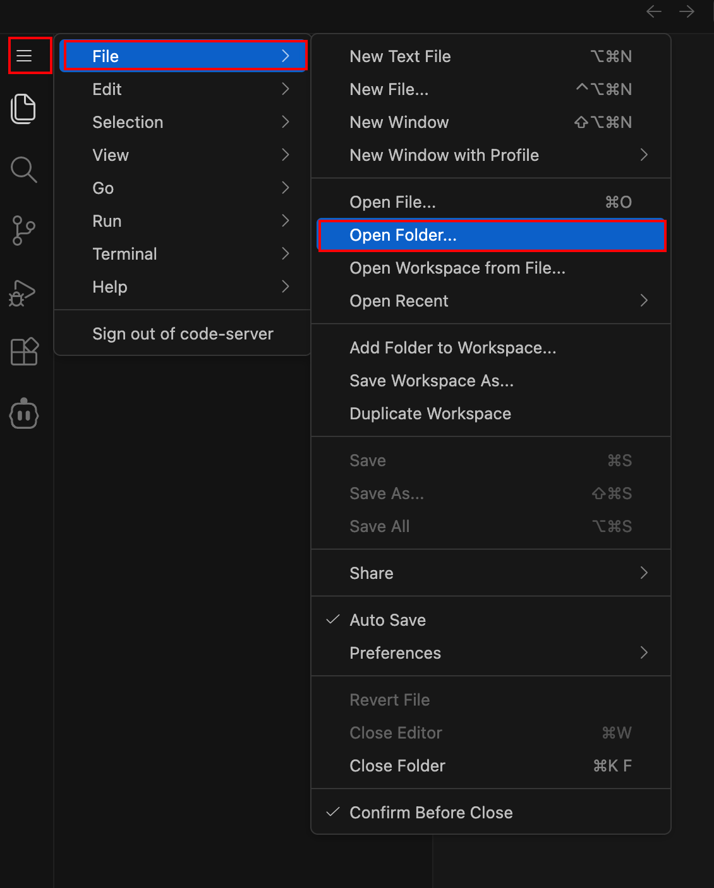
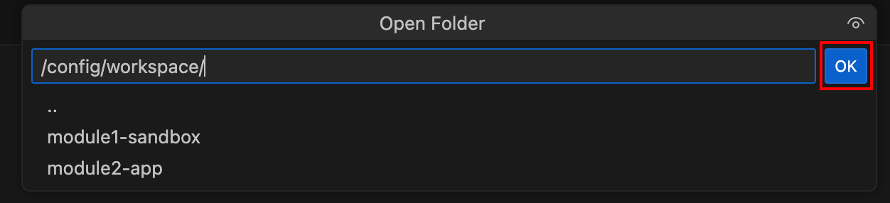
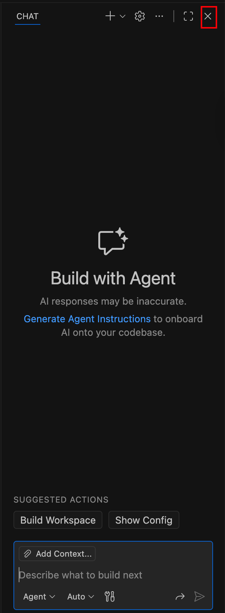
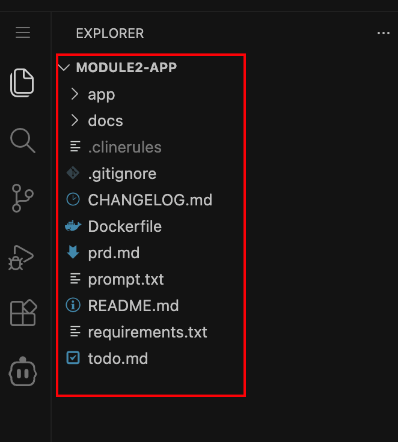
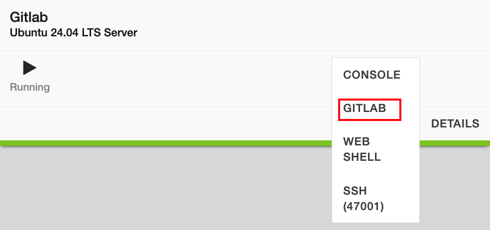
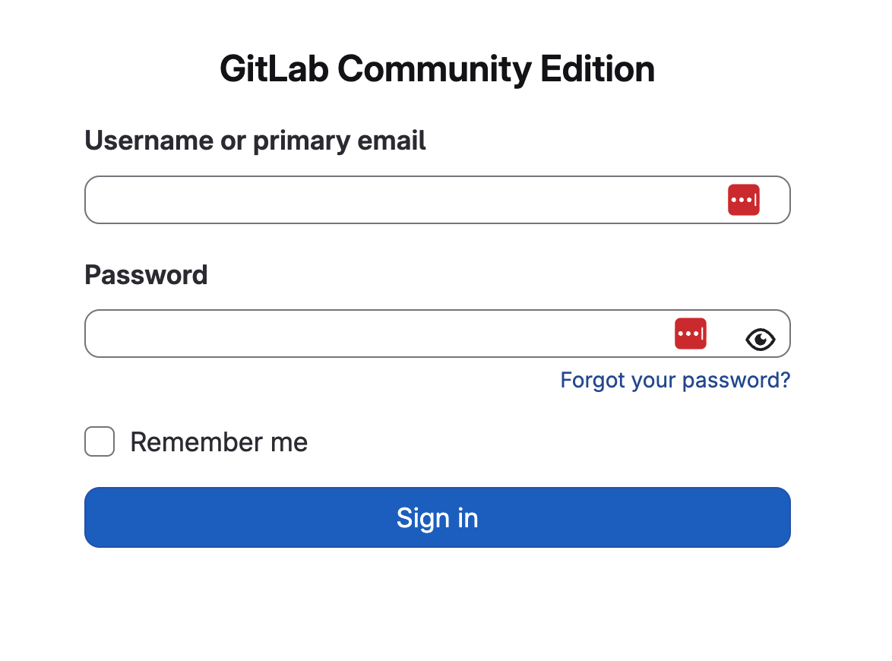
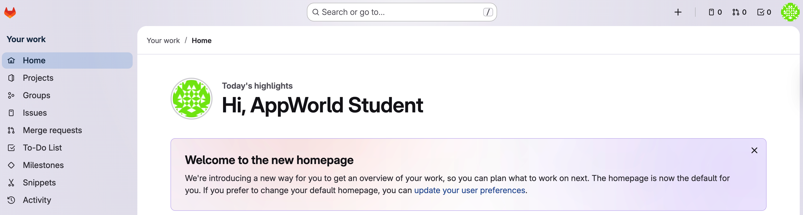
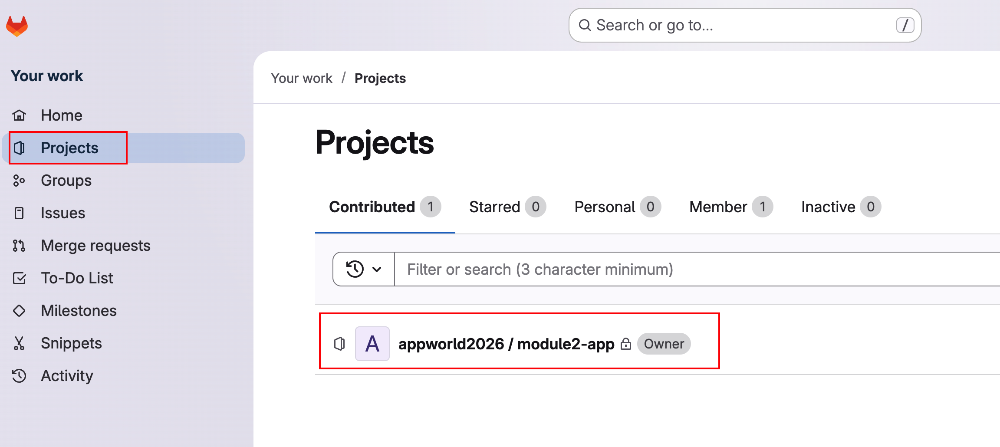
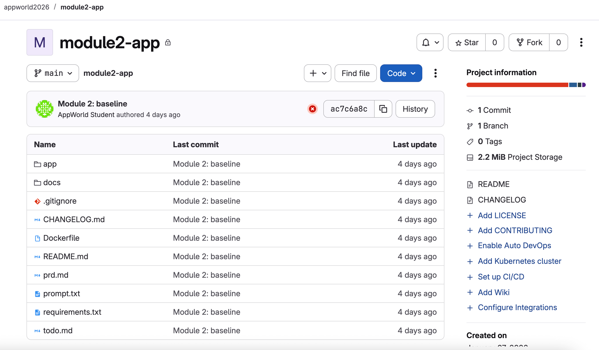
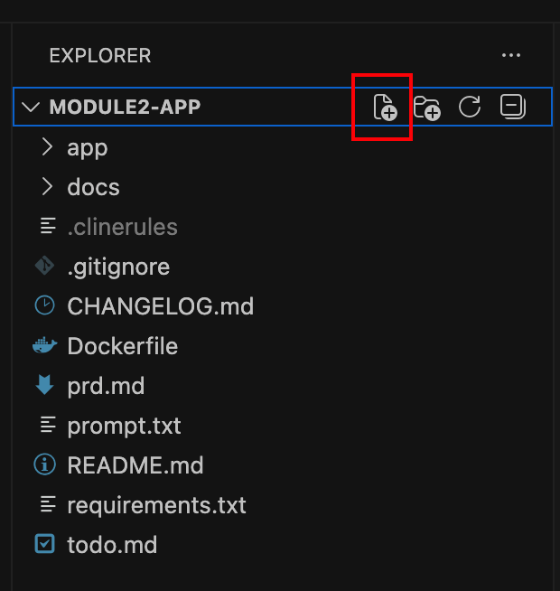
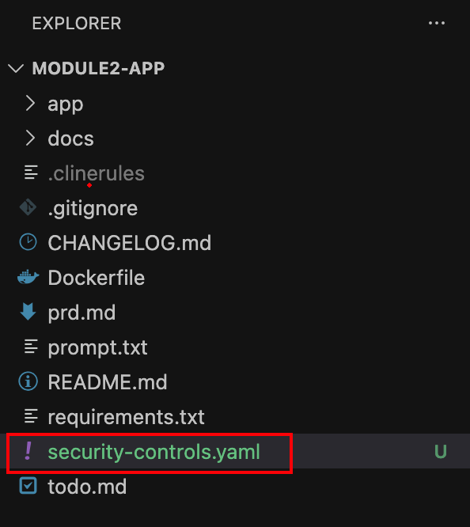
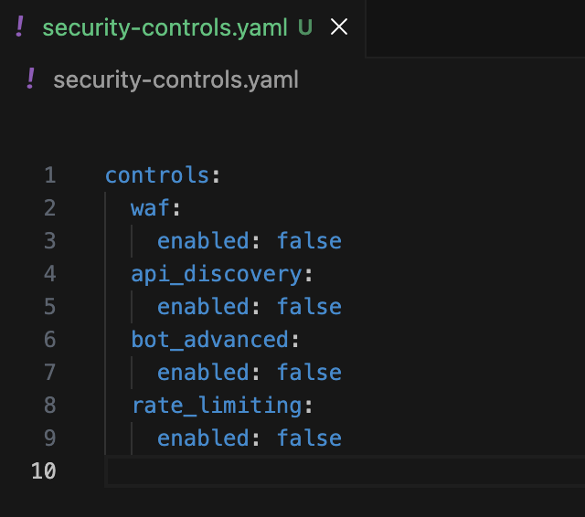
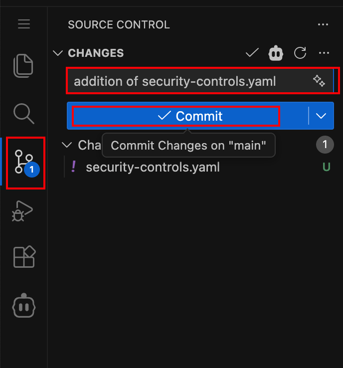
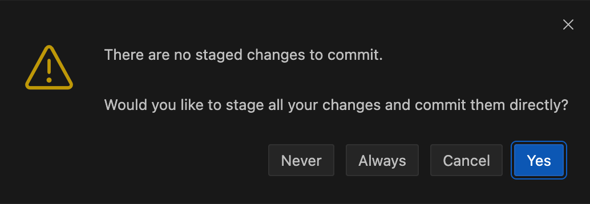
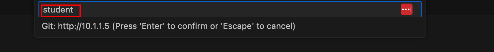
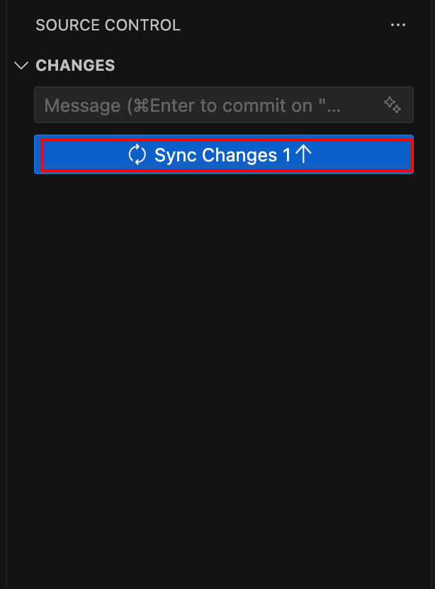
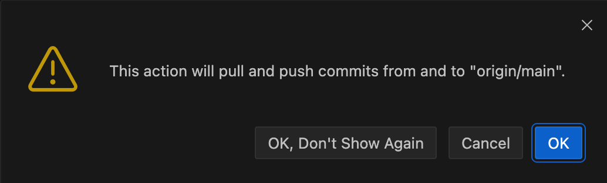
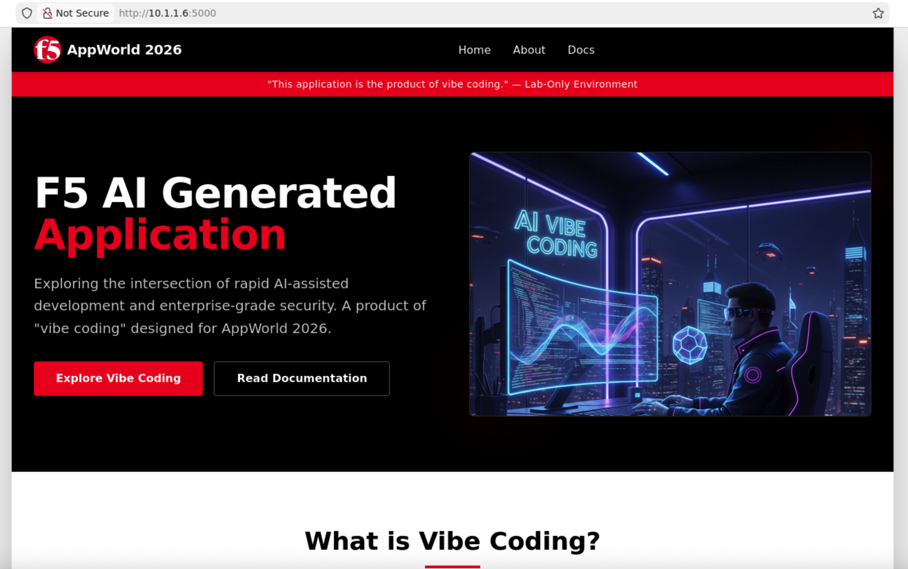
.. |labend| image:: ../_static/labend.png
   :width: 800px